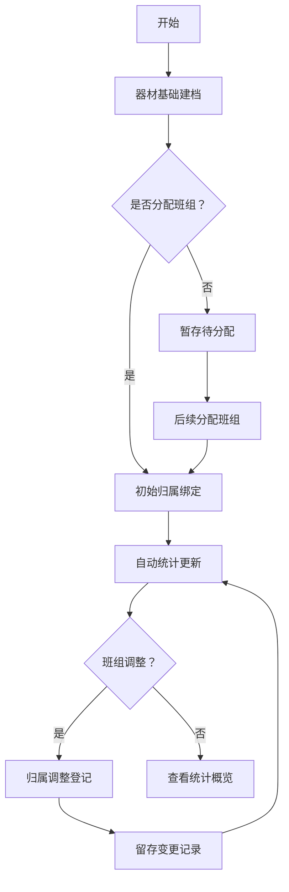

## 1. 产品概述

消防训练基地模拟器材训练班组归属绑定统计系统，用于管理训练器材与班组的绑定关系，自动统计各班组配套器材总量。解决训练器材归属不清、统计困难的问题，提升训练管理效率。

## 2. 核心功能

### 2.1 用户角色
| 角色 | 注册方式 | 核心权限 |
|------|----------|----------|
| 管理员 | 默认账号 | 器材管理、班组管理、统计查看 |

### 2.2 功能模块
1. **模拟训练器材管理**: 器材基础建档、规格维护
2. **训练班组管理**: 班组信息管理、分页清单展示
3. **归属绑定管理**: 初始绑定、归属调整、变更记录
4. **统计概览**: 班组器材数量统计、可视化展示

### 2.3 页面详情
| 页面名称 | 模块名称 | 功能描述 |
|----------|----------|----------|
| 首页/统计概览 | 统计看板 | 各班组器材数量统计可视化展示，图表概览 |
| 器材管理 | 器材列表 | 器材分页清单、新增、编辑、删除 |
| 班组管理 | 班组列表 | 班组分页清单、新增、编辑、删除 |
| 归属管理 | 绑定调整 | 器材归属班组绑定、调整、变更记录查看 |

## 3. 核心流程

## 4. 用户界面设计

### 4.1 设计风格
- **主色调**: 消防红色 (#DC143C) 搭配深蓝色 (#191970) 作为辅助色
- **按钮风格**: 圆角矩形，消防红色主按钮，深蓝色次按钮
- **字体**: 思源黑体，标题加粗，正文常规
- **布局**: 卡片式布局，侧边导航，顶部面包屑
- **图标**: Lucide 图标库，简洁现代风格

### 4.2 页面设计概览
| 页面名称 | 模块名称 | UI元素 |
|----------|----------|--------|
| 统计概览 | 统计卡片 | 班组器材数量卡片、柱状图、饼图 |
| 统计概览 | 快速入口 | 器材管理、班组管理、归属调整按钮 |
| 器材管理 | 列表表格 | 分页表格、搜索筛选、操作列 |
| 班组管理 | 列表表格 | 分页表格、搜索筛选、操作列 |
| 归属管理 | 绑定表单 | 器材选择、班组选择、确认按钮 |

### 4.3 响应式设计
- **桌面端优先**: 1200px+ 宽度，完整功能展示
- **平板适配**: 768px-1199px，侧边栏折叠
- **移动端适配**: <768px，底部导航，卡片堆叠

### 4.4 可视化展示
- 柱状图展示各班组器材数量对比
- 饼图展示器材类型分布
- 统计卡片展示关键指标（总器材数、总班组数、平均器材数）