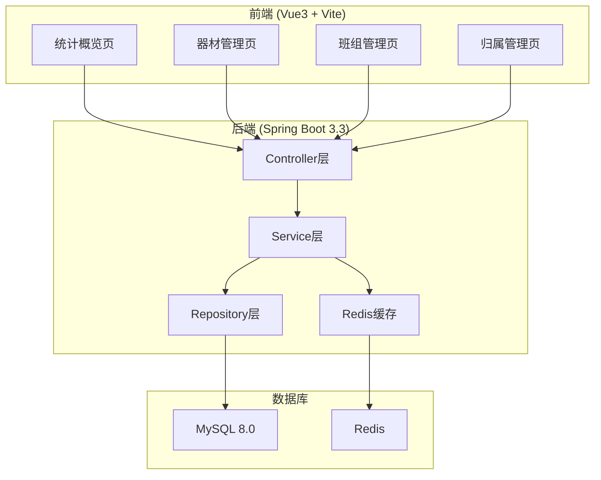
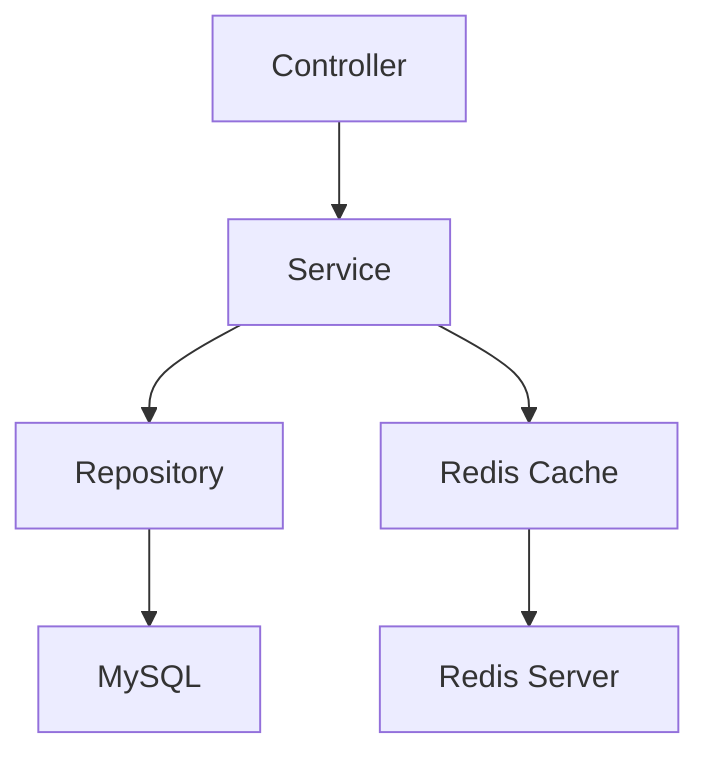
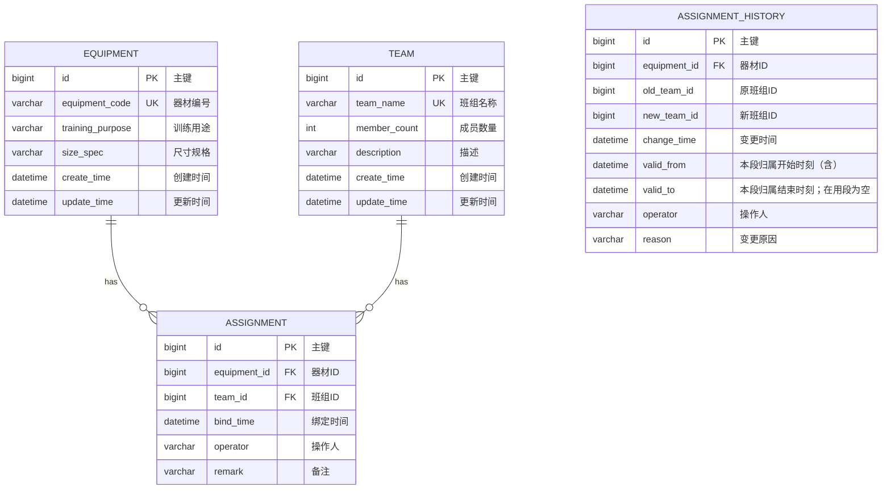

## 1. 架构设计



## 2. 技术描述

- **前端**: Vue3 + Vite + TypeScript + Element Plus + Tailwind CSS
- **后端**: Spring Boot 3.3 + JDK 17 + Maven + JPA
- **数据库**: MySQL 8.0
- **缓存**: Redis (Hash结构缓存器材规格模板)
- **构建**: Docker多阶段分层构建

## 3. 路由定义

| 路由 | 用途 |
|------|------|
| / | 统计概览首页 |
| /equipment | 器材管理列表 |
| /equipment/add | 新增器材 |
| /equipment/edit/:id | 编辑器材 |
| /team | 班组管理列表 |
| /team/add | 新增班组 |
| /team/edit/:id | 编辑班组 |
| /assignment | 归属绑定管理 |

## 4. API定义

### 4.1 器材管理 API
| 方法 | 路径 | 描述 |
|------|------|------|
| GET | /api/equipment | 分页查询器材列表 |
| POST | /api/equipment | 新增器材 |
| PUT | /api/equipment/{id} | 更新器材 |
| DELETE | /api/equipment/{id} | 删除器材 |
| GET | /api/equipment/{id} | 查询单条器材 |

### 4.2 班组管理 API
| 方法 | 路径 | 描述 |
|------|------|------|
| GET | /api/team | 分页查询班组列表 |
| POST | /api/team | 新增班组 |
| PUT | /api/team/{id} | 更新班组 |
| DELETE | /api/team/{id} | 删除班组 |
| GET | /api/team/{id} | 查询单条班组 |

### 4.3 归属管理 API
| 方法 | 路径 | 描述 |
|------|------|------|
| POST | /api/assignment/bind | 绑定器材到班组 |
| PUT | /api/assignment/adjust | 调整器材归属 |
| GET | /api/assignment/history | 查询变更记录（含每段区间起止） |
| GET | /api/assignment/team/{teamId} | 查询班组器材 |
| GET | /api/assignment/equipment/{equipmentId}/intervals | 查询一件器材的归属区间时间线 |
| GET | /api/assignment/ownership-mismatches | 对账：当前归属与流水末段对不上的器材清单（只列账不改账） |
| POST | /api/assignment/history/migrate-intervals | 老流水一次性推区间，推不动的逐件列明原因 |

### 4.4 统计 API
| 方法 | 路径 | 描述 |
|------|------|------|
| GET | /api/statistics/overview | 统计概览数据 |
| GET | /api/statistics/team | 各班组器材统计 |

## 5. 服务端架构图



## 6. 数据模型

### 6.1 数据模型定义



### 6.2 数据定义语言

```sql
CREATE TABLE equipment (
    id BIGINT AUTO_INCREMENT PRIMARY KEY,
    equipment_code VARCHAR(50) UNIQUE NOT NULL COMMENT '器材编号',
    training_purpose VARCHAR(100) NOT NULL COMMENT '训练用途',
    size_spec VARCHAR(100) COMMENT '尺寸规格',
    create_time DATETIME DEFAULT CURRENT_TIMESTAMP COMMENT '创建时间',
    update_time DATETIME DEFAULT CURRENT_TIMESTAMP ON UPDATE CURRENT_TIMESTAMP COMMENT '更新时间',
    INDEX idx_equipment_code (equipment_code)
) ENGINE=InnoDB DEFAULT CHARSET=utf8mb4 COMMENT='模拟训练器材表';

CREATE TABLE team (
    id BIGINT AUTO_INCREMENT PRIMARY KEY,
    team_name VARCHAR(50) UNIQUE NOT NULL COMMENT '班组名称',
    member_count INT DEFAULT 0 COMMENT '成员数量',
    description VARCHAR(200) COMMENT '描述',
    create_time DATETIME DEFAULT CURRENT_TIMESTAMP COMMENT '创建时间',
    update_time DATETIME DEFAULT CURRENT_TIMESTAMP ON UPDATE CURRENT_TIMESTAMP COMMENT '更新时间',
    INDEX idx_team_name (team_name)
) ENGINE=InnoDB DEFAULT CHARSET=utf8mb4 COMMENT='训练班组表';

CREATE TABLE assignment (
    id BIGINT AUTO_INCREMENT PRIMARY KEY,
    equipment_id BIGINT NOT NULL COMMENT '器材ID',
    team_id BIGINT NOT NULL COMMENT '班组ID',
    bind_time DATETIME DEFAULT CURRENT_TIMESTAMP COMMENT '绑定时间',
    operator VARCHAR(50) COMMENT '操作人',
    remark VARCHAR(200) COMMENT '备注',
    CONSTRAINT uk_equipment UNIQUE (equipment_id),
    INDEX idx_team_id (team_id),
    FOREIGN KEY (equipment_id) REFERENCES equipment(id),
    FOREIGN KEY (team_id) REFERENCES team(id)
) ENGINE=InnoDB DEFAULT CHARSET=utf8mb4 COMMENT='器材归属绑定表';

CREATE TABLE assignment_history (
    id BIGINT AUTO_INCREMENT PRIMARY KEY,
    equipment_id BIGINT NOT NULL COMMENT '器材ID',
    old_team_id BIGINT COMMENT '原班组ID',
    new_team_id BIGINT NOT NULL COMMENT '新班组ID',
    change_time DATETIME DEFAULT CURRENT_TIMESTAMP COMMENT '变更时间',
    valid_from DATETIME COMMENT '本段归属开始时刻（含）；与上一段 valid_to 严格相接',
    valid_to DATETIME COMMENT '本段归属结束时刻；在用段为 NULL',
    operator VARCHAR(50) COMMENT '操作人',
    reason VARCHAR(200) COMMENT '变更原因',
    INDEX idx_equipment_id (equipment_id),
    INDEX idx_change_time (change_time)
) ENGINE=InnoDB DEFAULT CHARSET=utf8mb4 COMMENT='归属变更记录表（区间链：同一件器材相邻段首尾相接，仅末段开口）';
```

### 6.3 Redis缓存设计

| Key | 类型 | 描述 |
|-----|------|------|
| equipment:spec:{code} | Hash | 器材规格模板缓存 |
| statistics:team | Hash | 班组统计数据缓存 |
| statistics:overview | String | 统计概览数据缓存 |